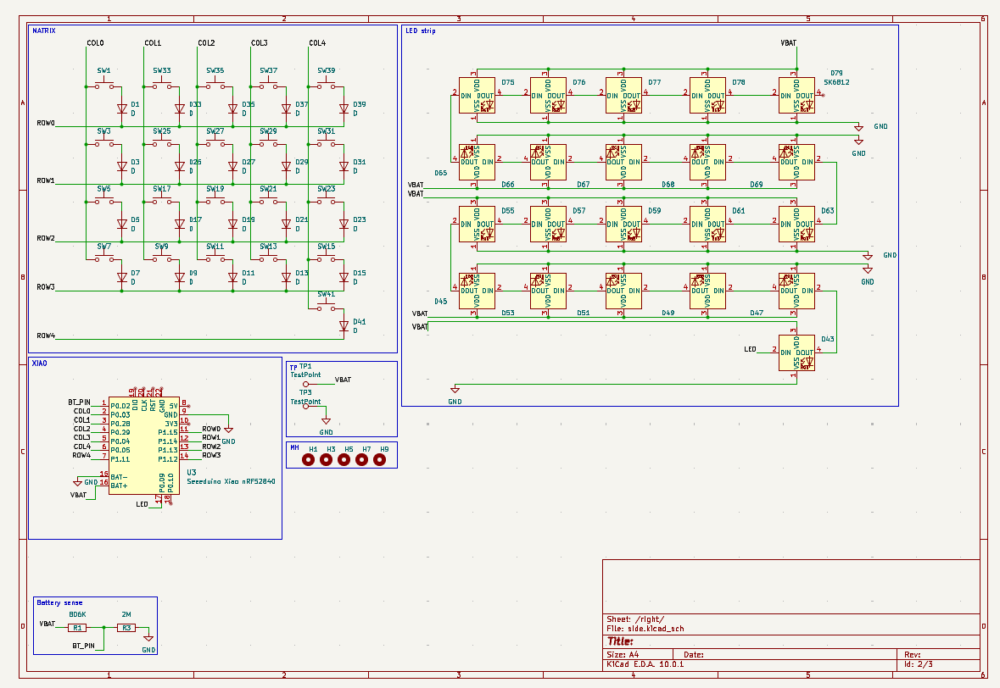
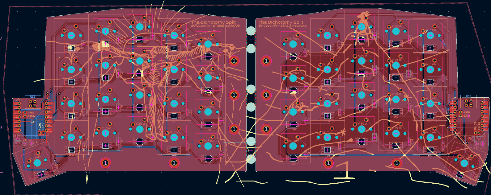
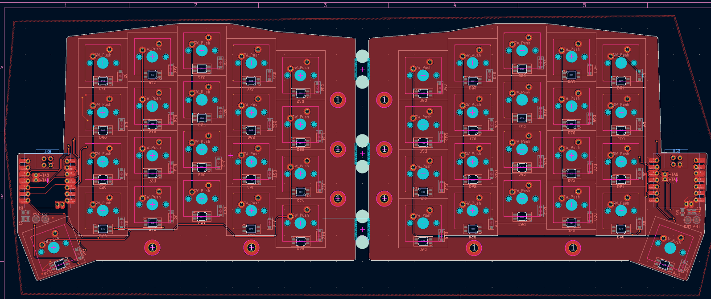
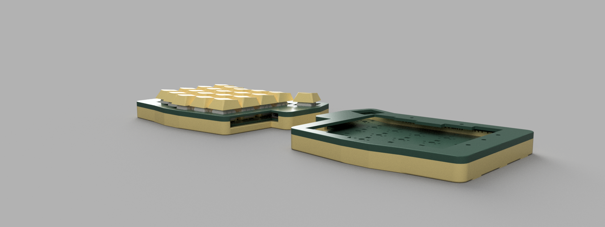
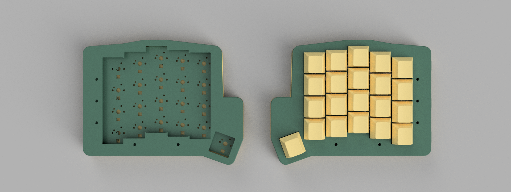
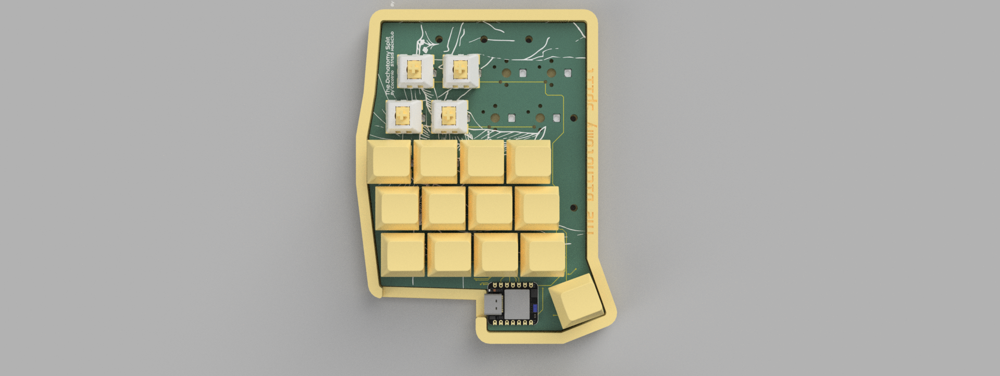

# The -Dichotomy- Split
An Split keyboard, created to understand new things like matrix and wireless things, and also from the feeling of being split, Im trying to become someone new but im still stuck in this hole, A tool for the transition... a bridge out of the hole.

## The reason behind this project...
Initially I wanted to prove myself I could go a little more deeper, what I mean Is that I had already made a macropad as my first hackclub project 4 months ago, and the split keyboard was the logical step, when I started with KiCad Fusion and coding.
everything was really hard im not saying today it isnt, but compared to how much I struggled 4 months ago, I can proudly say I have learned, and not just a little, but A LOT, and as I am writing this, throught my headphones KUNGFUPANDA theme song is blasting my
ears, this is the same song I used to play back and back again 4 months ago, and you see 4 months ago I was lost (im still kinda but not as I was), I was heartbroken, and without an actual purpose, and I saw I video on my feed talking about blueprint, this made
me really curious, and I started learning, and now here I am, well I wanted to learn about ZMK in my macropad I only did the QMK firmware but I really wanted to tryout ZMK, and was really cool!, also I wanted to make the projects that I thought were impossible
and to the Isaac of 4 months ago... Thanks!, you have really changed your life, and to the future Isaac... How are you doing? was it all worth it?... thanks for reading if you did! <3

## Schematic Overview

## PCB

## CAD Render

## BOM

| Item | Qty | Est. Price | Link |
| :--- | :---: | :---: | :--- |
| **Seeed Studio XIAO nRF52840** | 2 | $38.00 | [Amazon](https://www.amazon.com/gp/product/B09T9VVQG7/) |
| **XDA Profile PBT Keycaps** | 50 | $12.00 | [AliExpress](https://www.aliexpress.us/item/3256810402164930.html) |
| **Mechanical Switches (Tactile)** | 50 | $8.00 | [AliExpress](https://www.aliexpress.us/item/3256811652574937.html) |
| **SK6812 MINI-E RGB LEDs** | 100 | $7.00 | [AliExpress](https://www.aliexpress.us/item/3256810305129996.html) |
| **Custom PCB Fabrication** | 1 set | $15.00 | [JLCPCB / PCBWay] |
| **Misc (Diodes, Battery, Sockets)** | 1 set | $15.00 | [Various] |

## SPECIAL THANKS!
Thanks for reading! made possible with [STASIS by HackClubbers](http://stasis.hackclub.com/)

## You might also like!
[Voyager Panel](https://github.com/Cocotrilito/Voyager-Panel)
[HALO-0](https://github.com/Cocotrilito/HALO-0)

## final thanks :3
By cocotrilo made with luv (THIS ONE WAS WITH philosophical meaning) keep the grind <3
